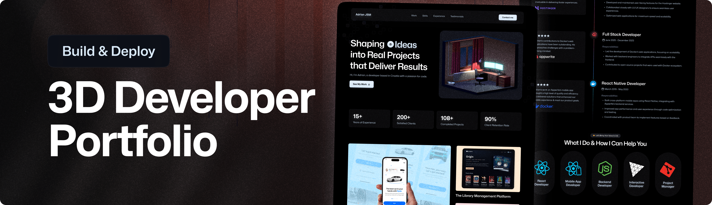

<div align="center">
  <br />
    <a href="" target="_blank">
      
    </a>
  <br />

  <div>
    
    
    
  </div>

  <h3 align="center">Interactive 3D Portfolio Website</h3>
</div>

## 📋 <a name="table">Table of Contents</a>

1. ✨ [Introduction](#introduction)
2. ⚙️ [Tech Stack](#tech-stack)
3. 📝 [Features](#features)
4. 🤸 [Quick Start](#quick-start)

## <a name="introduction">✨ Introduction</a>

**`[EN]`** The 3D Portfolio project is a highly engaging personal website that features animated 3D scenes, smooth camera transitions, interactive model showcases, and responsive design. It’s ideal for developers, designers, or freelancers looking to stand out in the digital crowd.

**`[FR]`** Ce portfolio 3D est une vitrine personnelle immersive, conçue pour captiver grâce à des scènes animées en 3D, des transitions de caméra fluides, des modèles interactifs et un design entièrement responsive. Idéal pour les développeurs, designers ou freelances souhaitant affirmer leur identité et se démarquer dans le monde numérique.

## <a name="tech-stack">⚙️ Tech Stack</a>

- [**Three.js**](https://threejs.org/) is a JavaScript library for creating and displaying 3D graphics in the browser using WebGL. It simplifies complex 3D rendering tasks by providing a higher-level API, making it easier to build interactive 3D experiences for games, visualizations, and creative web applications.

- [**React Three Fiber**](https://docs.pmnd.rs/react-three-fiber) is a React renderer for Three.js that enables developers to build 3D scenes using declarative React components. It brings the power of React to WebGL, allowing seamless integration of 3D content in modern web applications.

- [**Drei**](https://drei.docs.pmnd.rs/) is a helper library for React Three Fiber that offers a collection of useful abstractions and ready-to-use components. It speeds up 3D development by providing tools for cameras, controls, environments, and more—reducing boilerplate and streamlining the workflow.

- [**GSAP (GreenSock Animation Platform)**](https://gsap.com/) is a robust JavaScript library for building high-performance animations. Known for its smooth and reliable behavior, GSAP is ideal for animating DOM elements, SVGs, and WebGL content, offering precise control over complex sequences and timelines.

- [**Tailwind CSS**](https://tailwindcss.com/) is a utility-first CSS framework for rapidly building custom user interfaces. It promotes a compositional styling approach using utility classes directly in HTML, enabling faster prototyping and consistent, maintainable designs.

- [**Vite**](https://vitejs.dev/) is a modern build tool that provides lightning-fast development and optimized production builds. It uses native ES modules and features like hot module replacement to deliver a snappy developer experience, making it a favorite for React, Vue, and other modern frameworks.

- [**React 19**](https://react.dev/blog/2024/12/05/react-19) is the upcoming major version of React that introduces new features like the React Compiler, enhanced performance, and developer-focused improvements. It continues to evolve the component-based architecture while simplifying complex patterns and boosting app efficiency.


## <a name="features">📝 Features</a>

👉 Animated 3D models and reveal animations

👉 Realistic lighting and shadows

👉 GSAP-powered scroll interactions

👉 Responsive design with Tailwind CSS and Flexbox/Grid

👉 Micro Interactions

👉 Multi-section layout (About, Projects, Contact)

👉 Mobile optimized 3D experience

and many more, including code architecture and reusability.

## <a name="quick-start">🚀 Quick Start</a>

Follow these steps to set up the project locally on your machine.

**Prerequisites**

Make sure you have the following installed on your machine:

- [Git](https://git-scm.com/)
- [Node.js](https://nodejs.org/en)
- [npm](https://www.npmjs.com/) (Node Package Manager)

**Cloning the Repository**

```bash
git clone {git remote URL}
```

**Installation**

Install the project dependencies using npm:

```bash
npm install
```

**Set Up Environment Variables**

Create a new file named `.env` in the root of your project and add the following content:

```env
VITE_APP_EMAILJS_SERVICE_ID=
VITE_APP_EMAILJS_TEMPLATE_ID=
VITE_APP_EMAILJS_PUBLIC_KEY=
```

Replace the placeholder values with your actual **[EmailJS](https://www.emailjs.com/)** credentials.

**Running the Project**

```bash
npm run dev
```

Open [http://localhost:5173](http://localhost:5173/) in your browser to view the project.# 3d-room_portfolio_react
